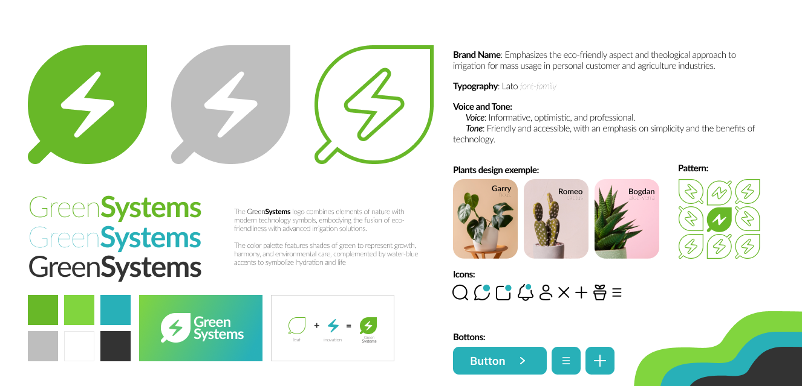

<h2 align="center">GreenSystems</h2>

<h5 align="center"><i>a PBL project aimed to solve your houseplant and agriculture watering problems</i></h5> 

                           
  

 

  

<h5 align="center">UTM | FAF | PBL | Spring 2024</h5> 

 

## Team members:

- Corețchi Mihai [ [ eamtcPROG
](https://github.com/eamtcPROG)]
- Bogdan Zlatovcen [ [bogdan-404](https://github.com/bogdan-404)]
- Cristian Brinza [ [CristianBrinza ](https://github.com/CristianBrinza)]
- Stefan Nistor [ [StefanNistor69](https://github.com/StefanNistor69)]

## Assets:

                           
  

 